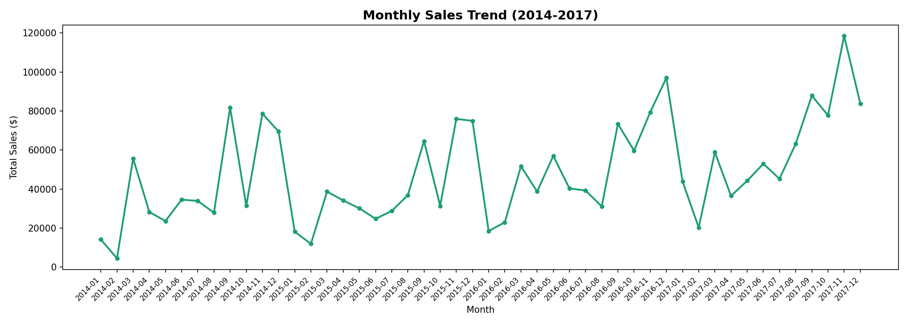
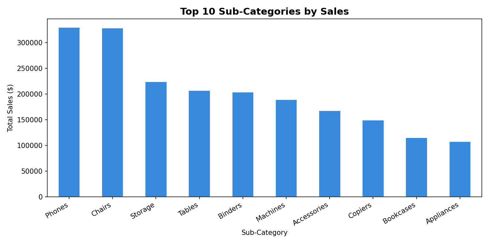
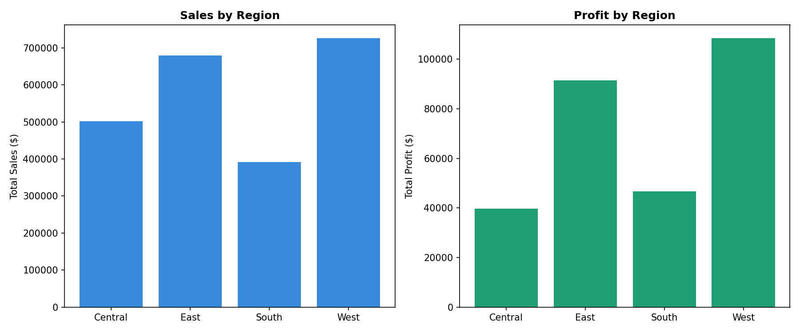
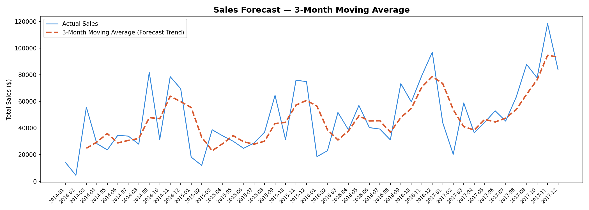
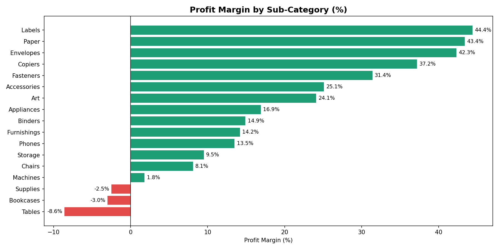
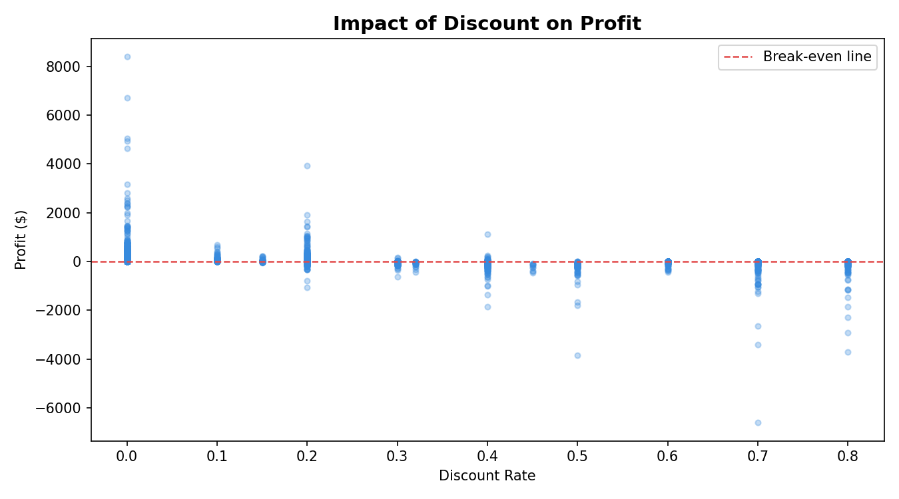
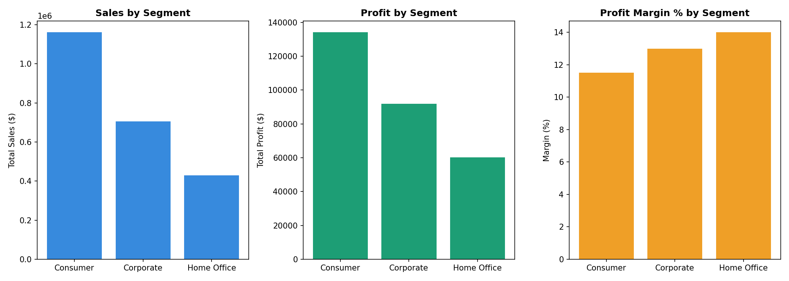

# FMCG-Sales-Analysis
Sales trend analysis and demand forecasting on FMCG superset data using Python
# FMCG Sales Analysis & Demand Forecasting

## Overview
Exploratory data analysis and demand forecasting on a retail superstore dataset 
with 9,994 transactions across 4 years (2014–2017). The analysis uncovers 
revenue trends, profitability gaps, discount impact, and customer segment value 
to support data-driven business decisions.

## Business Questions that are Answered
**1. Which months show peak demand and how can inventory be planned around them?**
November and December consistently show peak sales of $100K–$120K per month across
all 4 years. January is the weakest month at $10K–$20K. Recommendation: Build
inventory 6–8 weeks before October to meet November peak demand. Plan clearance sales for January to manage post-holiday inventory.

**2. Which product sub-categories drive the most revenue?**
-Phones ($330K) and Chairs ($320K) are the top 2 revenue generators. However, 
high sales don't always mean high profit,e.g., Machines rank 6th in sales but have only 1.8% profit margin.

**3. Which products are losing money?**
Tables (-8.6%), Bookcases (-3%), and Supplies (-2.5%) have negative profit 
margins. Despite generating sales, these sub-categories are net losses for the 
business, a key recommendation for pricing or discount review.

**4. Does discounting help or hurt?**
Statistical analysis reveals a negative correlation of -0.219 between discount 
rate and profit. Orders with discounts above 40% almost universally fall below 
the break-even line, confirming that heavy discounting is destroying value.

**5. Which regions are most and least profitable?**
West region is most profitable with $725K sales and $108K profit (15% margin).
Central region is least profitable with $380K sales but only $39K profit (10% margin).
Despite East region having higher sales ($680K), West generates more profit due to
better cost management. Central region needs pricing review and operational efficiency.

**6. Which customer segment is most valuable?**
Consumer segment drives the highest absolute sales ($1.16M) and profit ($134K). 
However, Home Office has the best profit margin at 14% vs Consumer's 11.5% 
making it the most efficient segment to target for growth.

**7. What is the overall sales growth trend?**
Total sales grew from approximately $400K in 2014 to $650K in 2017 i.e. a 62% increase
over 4 years. Year-over-year growth averages 15–18%. The 3-month moving average
forecast confirms this upward trajectory, with 2017 showing the strongest quarterly
performance, indicating healthy business momentum.

## What are the Key Findings : 
- **West region** leads in both sales ($725K) and profit ($108K)
- **Central region** shows a profit efficiency gap, high sales but lowest profit margin
- **Phones and Chairs** are the top 2 revenue-generating sub-categories
- Sales show a consistent **year-end spike (November–December)** every year
- Overall sales grew approximately **3x from 2014 to 2017**

## Key Recommendations : 
- Discontinue or reprice Tables and Bookcases to eliminate loss-making SKUs
- Cap discount rates at 20% to protect profit margins
- Prioritise West region expansion and investigate Central region inefficiencies
- Target Home Office segment for high-margin growth campaigns
- Build inventory buffers ahead of November for peak season demand

## Tools & Technologies used 
- Python 3, Pandas, Matplotlib, Seaborn
- Jupyter Notebook
- Dataset: Sample Superstore (Kaggle)

## Project Structure
fmcg-sales-analysis/

--analysis.ipynb          # Main analysis notebook
--monthly_sales_trend.png
--top_subcategories.png
--region_performance.png
--sales_forecast.png

## Charts Generated
1. Monthly Sales Trend (2014–2017)
2. Top 10 Sub-Categories by Sales
3. Regional Sales & Profit Comparison
4. 3-Month Moving Average Forecast
5. Profit Margin by Sub-Category
6. Impact of Discount Rate on Profit
7. Customer Segment Analysis

## Visualisations

